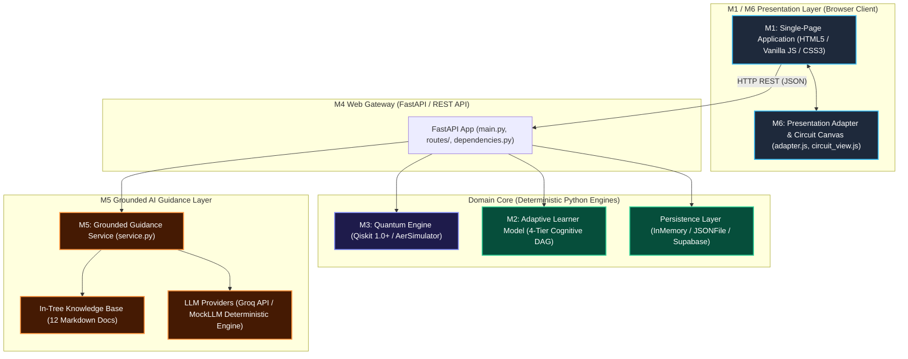

# Q-BIT.140 — Reverse-Engineered System Architecture

## 1. System Overview

Q-BIT.140 is an AI-guided, quantum-grounded adaptive learning platform designed for quantum computing concepts, with a specialized initial curriculum centered on **Grover's 2-Qubit Search Algorithm**.

The system is constructed around a strict, decoupled **6-Module Architecture (M1–M6)** that enforces hard architectural boundaries between physical quantum simulation, cognitive learner modeling, REST gateway orchestration, generative AI guidance, and UI presentation.



---

## 2. Module Boundaries and Core Responsibilities

The system consists of six distinct architectural modules:

### M1: Frontend UI (`frontend/index.html`, `frontend/css/styles.css`, `frontend/js/api_client.js`)
- **Responsibility**: Interactive student interface. Renders the State Triad, Causal Timeline, State Inspector, Circuit Studio, and AI explanation chat box.
- **Technology**: Vanilla ECMAScript Modules (ES6+), modern CSS custom properties (glassmorphism design system), and KaTeX for LaTeX mathematical rendering.
- **Boundary Rule**: Never imports backend libraries, never directly interacts with Qiskit, and never executes adaptive logic client-side. All state mutations occur via M4 REST requests.

### M2: Adaptive Learner Engine (`backend/adaptive/`)
- **Responsibility**: Sole authority over cognitive state inference, evidence sufficiency, prerequisite tracking, and pedagogical routing.
- **Architecture**: 4-Tier deterministic cognitive engine (Raw Observation $\rightarrow$ Historical Evidence $\rightarrow$ Cognitive Inference $\rightarrow$ Pedagogical Recommendation).
- **Boundary Rule**: 100% deterministic, zero LLM dependency. Cannot invent execution results or alter quantum physics rules.

### M3: Quantum Execution Engine (`backend/quantum/`)
- **Responsibility**: Sole authority over quantum circuit synthesis, validation, and physical simulation.
- **Engine**: Qiskit 1.0+ circuit builder running 1024-shot simulations on `qiskit_aer.AerSimulator()`.
- **Boundary Rule**: Completely frozen. Exposes pure-Python, Qiskit-free dataclasses (`SimulationResult`, `CircuitMetadata`). Downstream consumers never receive raw Qiskit objects.

### M4: Backend REST Gateway (`backend/api/`)
- **Responsibility**: High-performance asynchronous REST API built with FastAPI and Pydantic v2.
- **Orchestration**: Manages request lifecycles, validates input contracts, coordinates M3 execution, passes evidence to M2, persists state to repository, and routes explanations to M5.
- **Boundary Rule**: Pure serialization and routing; contains no standalone business logic or quantum heuristics.

### M5: Grounded AI Guidance (`backend/ai/`)
- **Responsibility**: Grounded pedagogical explanation service. Explains quantum theory, clarifies student misconceptions, and explains why M2 made a specific adaptive decision.
- **Architecture**: Retrieval-Augmented Generation (RAG) over 12 in-tree verified markdown knowledge files.
- **Boundary Rule**: Read-only explanation layer. Hard boundary prevents LLM from fabricating quantum counts, altering learner mastery, or selecting curriculum activities.

### M6: Visualization & Presentation Adapter (`frontend/js/adapter.js`, `frontend/js/circuit_view.js`, `frontend/visualization/`)
- **Responsibility**: Presentation data normalization. Transforms raw API JSON into Dirac ket notation ($|10\rangle$), percentage strings, badge metrics, and circuit canvas SVG/Canvas elements.
- **Boundary Rule**: Presentation-only transformation. Never modifies counts, probabilities, or adaptive decisions.

---

## 3. Runtime Components & Entry Points

| Component | Physical Entry Point | Runtime Command / Invocation | Role |
|---|---|---|---|
| **Backend REST API** | `backend/api/main.py:app` | `uvicorn backend.api.main:app --reload --port 8000` | FastAPI ASGI web server serving API routes and static frontend |
| **Frontend Web App** | `frontend/index.html` | Browser access at `http://127.0.0.1:8000/` or standalone HTTP server | Single-page application loaded in client browser |
| **Quantum Engine** | `backend/quantum/engine.py:run_experiment` | Invoked synchronously by `submit_activity_attempt` in M4 | Assembles Qiskit circuit and runs Aer simulator |
| **Adaptive Model** | `backend/adaptive/engine.py:LearnerModel` | Instantiated via FastAPI dependency injection (`get_learner_model`) | Updates learner cognitive profile and computes recommendations |
| **AI Guidance** | `backend/ai/service.py:ask_question`, `explain_experiment` | Invoked by M4 AI route handlers (`handle_ask`, `handle_explain_experiment`) | Performs keyword retrieval and queries LLM provider |
| **Persistence Repo** | `backend/adaptive/repository.py:get_learner_repository` | Configured via `STORAGE_BACKEND` env var (`in_memory`, `json_file`, `supabase`) | Manages atomic storage of `LearnerState` records |

---

## 4. Trust Boundaries & Security Enclaves

```
+-----------------------------------------------------------------------------------+
| UNTRUSTED EXTERNAL ZONE (Browser Client)                                          |
|  - Learner input strings (e.g. "10", "A")                                         |
|  - Learner ID identifier string                                                   |
|  - Free-form chat questions                                                       |
+-----------------------------------------------------------------------------------+
                                   |
                      HTTP REST + JSON (Port 8000)
                                   v
+-----------------------------------------------------------------------------------+
| M4 REST API BOUNDARY (FastAPI Gateway)                                            |
|  - Pydantic Schema Validation (Strict type checking, 422 Unprocessable Entity)    |
|  - Route Authorization & Error Catching (404 Not Found, 500 Quantum, 503 Storage) |
+-----------------------------------------------------------------------------------+
       |                                   |                              |
       v                                   v                              v
+------------------------+   +---------------------------+   +----------------------+
| M3 QUANTUM ENCLAVE     |   | M2 COGNITIVE ENCLAVE      |   | M5 AI ENCLAVE        |
| - Parameter validation |   | - Deterministic DAG       |   | - Read-only KB RAG   |
| - Qiskit Aer Sandbox   |   | - Pure math / no LLM      |   | - Context grounding  |
| - Qiskit-free returns  |   | - Atomic state repository |   | - Hallucination block|
+------------------------+   +---------------------------+   +----------------------+
```

### Trust Guarantees:
1. **No Client Trust for State**: The browser cannot send a modified mastery score or claim an activity is completed. It only sends `learner_id` and raw `response`.
2. **Deterministic Evidence Creation**: M4 uses verified M3 simulation output and static activity metadata to construct `LearnerEvidence`. The client cannot spoof correctness.
3. **LLM Sandboxing**: The LLM in M5 is isolated behind structured prompt templates. Its response is never fed back into M2 or M3; it is strictly returned to the client as an explanatory string.
