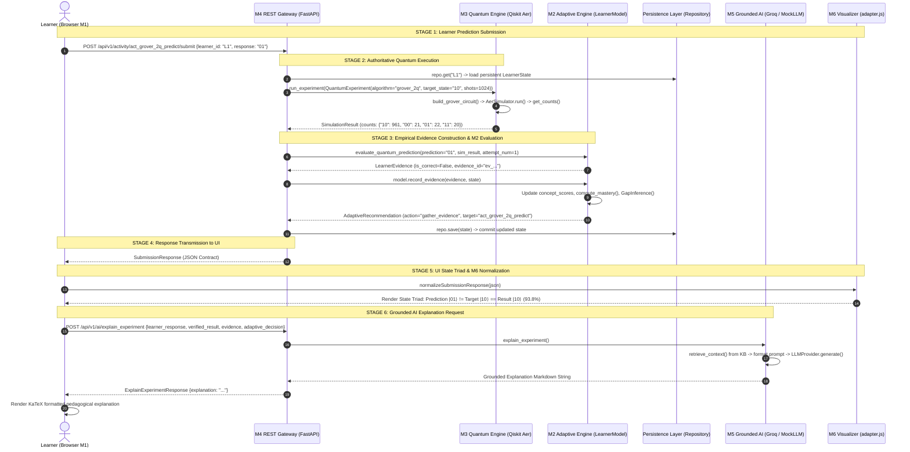

# Q-BIT.140 — End-to-End Data-Flow Trace

## 1. Conceptual Pedagogical Loop

The complete architectural lifecycle of a learner interaction follows the 8-stage **Adaptive Pedagogical Loop**:



---

## 2. Detailed Step-by-Step Data Flow Analysis

### Transition A: Learner Prediction Submission
- **Source**: `frontend/index.html` (DOM Button Click on `#submitBtn`)
- **Event Handler**: `submitPredictionHandler()` in inline module script
- **Input**: `learner_id` from localStorage (e.g. `"mvp_evaluator_001"`), `response` from selected radio button (e.g. `"01"`)
- **API Boundary**: Calls `submitPrediction(activityId, learnerId, response)` in `frontend/js/api_client.js`
- **Wire Payload**:
  ```json
  POST /api/v1/activity/act_grover_2q_predict/submit
  Content-Type: application/json
  {
    "learner_id": "mvp_evaluator_001",
    "response": "01"
  }
  ```

### Transition B: Backend Ingestion & Validation
- **Source**: `backend/api/routes/activities.py:submit_activity_attempt()`
- **Validation**: Pydantic `SubmissionRequest` enforces non-empty string constraints.
- **Activity Resolution**: `get_activity("act_grover_2q_predict")` fetches activity specification from `backend/adaptive/activities.py`.
- **State Loading**: `repo.get(learner_id)` loads `LearnerState` from in-memory/disk/Supabase storage. If repository raises `PersistenceError`, HTTP 503 is returned.

### Transition C: Authoritative Quantum Execution
- **Source**: `backend/quantum/engine.py:run_experiment()`
- **Schema**: Constructs `QuantumExperiment(algorithm="grover_2q", num_qubits=2, target_state="10", iterations=1, shots=1024)`
- **Validation**: `backend/quantum/validator.py:validate_experiment()` verifies `algorithm in ALGORITHM_REGISTRY`, `shots > 0`, `num_qubits == len(target_state)`.
- **Circuit Construction**: `backend/quantum/algorithms/grover.py:build_grover_circuit()`:
  - Adds Hadamard gates on qubits 0 and 1: $H^{\otimes 2}|00\rangle = \frac{1}{2}(|00\rangle + |01\rangle + |10\rangle + |11\rangle)$.
  - Applies Oracle for target state $|10\rangle$: $X(q_0) \rightarrow CZ(q_0, q_1) \rightarrow X(q_0)$, marking $|10\rangle$ with a $\pi$ phase flip ($-|10\rangle$).
  - Applies Diffusion Operator: $H^{\otimes 2} \rightarrow X^{\otimes 2} \rightarrow CZ \rightarrow X^{\otimes 2} \rightarrow H^{\otimes 2}$, performing inversion about the mean.
  - Adds measurement operations to classical registers $c_0, c_1$.
- **Execution**: `backend/quantum/execution.py:execute_circuit()` passes circuit to `qiskit_aer.AerSimulator().run(shots=1024)`.
- **Output**: Returns raw counts, e.g. `{"10": 961, "00": 21, "01": 22, "11": 20}`.
- **Normalization**: Wraps counts in `SimulationResult` (`backend/quantum/results.py`), calculating derived properties:
  - `probabilities`: `{"10": 0.9385, "00": 0.0205, "01": 0.0215, "11": 0.0195}`
  - `target_probability`: `0.9385`
  - `most_likely_state`: `"10"`
  - `circuit`: `CircuitMetadata(depth=7, gate_counts={'h': 4, 'x': 4, 'cz': 2, 'measure': 2}, diagram="...")`

### Transition D: Evidence Evaluation
- **Source**: `backend/adaptive/evidence.py:evaluate_quantum_prediction()`
- **Evaluation Logic**:
  - Compares learner prediction (`"01"`) against simulation most likely state (`"10"`).
  - Determines `is_correct = (prediction == sim_result["most_likely_state"])` $\rightarrow$ `False`.
  - Determines sufficiency level: Attempt 1 is categorized as `"insufficient"`.
  - Generates deterministic UUID `evidence_id = "ev_..."`.
- **Output**: Dataclass `LearnerEvidence`.

### Transition E: M2 State Accumulation & Adaptive Decision
- **Source**: `backend/adaptive/engine.py:LearnerModel.record_evidence()`
- **State Updates**:
  - Appends `evidence.to_dict()` to `state.evidence_history`.
  - Updates `state.attempts["quantum.algorithm.grover_2q"] += 1`.
  - Appends `0.0` to `state.score_history["quantum.algorithm.grover_2q"]`.
  - Records error: `state.errors["Grover's Algorithm"].append("01")`.
  - Computes Bayesian mastery: $\text{Mastery} = \frac{1 + \sum w_i S_i}{2 + \sum w_i} \approx 0.33$.
  - Generates `GapInference`: `status="observing"`, `confidence=0.35`, `trend="initial_observation"`, `evidence_sufficiency="insufficient"`.
- **Pedagogical Routing Decision**:
  - Single Error Rule: Since `recent_errors == 1`, M2 triggers `action="gather_evidence"`, `target="act_grover_2q_predict"`.
  - Returns `AdaptiveRecommendation`.

### Transition F: Persistence & API Response
- **Source**: `backend/api/routes/activities.py`
- **Persistence**: `repo.save(state)` commits the updated state.
- **Serialization**: Returns `SubmissionResponse` (Pydantic model) containing the complete 6-element envelope:
  1. `activity` (metadata)
  2. `learner_response` (`"01"`)
  3. `verified_result` (Qiskit simulation counts & probabilities)
  4. `evidence` (correctness, sufficiency, timestamp)
  5. `learner_state` (accumulated mastery and gap inferences)
  6. `adaptive_decision` (action, target, reason, trigger)

### Transition G: Frontend Rendering & State Triad
- **Source**: `frontend/js/adapter.js:normalizeSubmissionResponse()`
- **DOM Updates**:
  - Updates State Triad cards: Prediction (`|01⟩`, Mismatch), Target (`|10⟩`), Result (`|10⟩` at `93.8%`).
  - Renders Probability Distribution Bar Chart with 4 computational basis states ($|00\rangle, |01\rangle, |10\rangle, |11\rangle$).
  - Updates Causal Timeline and State Inspector tables.
  - Updates "Why This Next?" card displaying trigger (`single_prediction_mismatch`) and recommendation (`gather_evidence`).

### Transition H: Grounded AI Explanation
- **Source**: `frontend/js/api_client.js:explainExperiment()` $\rightarrow$ `POST /api/v1/ai/explain_experiment`
- **Backend Service**: `backend/ai/service.py:explain_experiment()`
- **Context Construction**: Formats strict prompt template embedding the exact counts from `verified_result` and decision from `adaptive_decision`.
- **Retrieval**: `backend/ai/retrieval.py` fetches relevant excerpts from `07_grovers_algorithm.md` and `10_ai_guidance_rules.md`.
- **Generation**: `GroqLLMProvider` or `MockLLMProvider` produces an explanation formatted in Markdown + KaTeX.
- **UI Update**: Injects response into `#chatHistory` with live KaTeX rendering.
