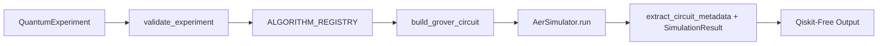

# Q-BIT.140 — M3 Quantum Engine Deep Dive

## 1. Engine Overview & Guarantees

The M3 Quantum Engine (`backend/quantum/`) is the authoritative source of quantum execution simulation in Q-BIT.140.

### Core Architectural Guarantees:
1. **Real Quantum Execution**: Runs real quantum circuits compiled in Qiskit 1.0+ on `qiskit_aer.AerSimulator()` with 1024 measurement shots.
2. **Qiskit-Free API Surface**: Never leaks Qiskit types (`QuantumCircuit`, `DAGCircuit`, `Operator`) across module boundaries. All outputs are converted into pure-Python dataclasses (`SimulationResult`, `CircuitMetadata`).
3. **100% Frozen**: M3 contains no dependencies on FastAPI, Pydantic, database drivers, or LLM providers.

---

## 2. Grover's 2-Qubit Algorithm: Step-by-Step Mathematical Decomposition

Grover's algorithm searches an unsorted database of $N = 2^n$ elements in $\mathcal{O}(\sqrt{N})$ queries. For $N = 4$ ($n = 2$ qubits), exactly **1 Grover iteration** achieves theoretical $100\%$ success probability.

### Step 1: Initial State & Uniform Superposition
- Two qubits initialized to ground state $|00\rangle$:
  $$|\psi_0\rangle = |00\rangle$$
- Apply Hadamard gates to all qubits ($H^{\otimes 2}$):
  $$|\psi_1\rangle = H^{\otimes 2}|00\rangle = \frac{1}{2}\big(|00\rangle + |01\rangle + |10\rangle + |11\rangle\big)$$
- **State Vector Representation**:
  $$|\psi_1\rangle = \begin{bmatrix} 0.5 \\ 0.5 \\ 0.5 \\ 0.5 \end{bmatrix}$$
- Measurement probability for any state: $P(x) = |0.5|^2 = 0.25$ ($25\%$).

### Step 2: Phase Oracle ($O_w$) for Target State $|10\rangle$
- The oracle marks the target state $|w\rangle = |10\rangle$ with a $\pi$ phase shift (inverting its amplitude sign):
  $$O_w|x\rangle = (-1)^{f(x)}|x\rangle, \quad f(x) = \begin{cases} 1 & \text{if } x = 10 \\ 0 & \text{otherwise} \end{cases}$$
- Implementation in `grover.py:_apply_oracle`:
  1. For bitstring `"10"`, bit 0 is `'0'`, bit 1 is `'1'`.
  2. Apply $X(q_0)$ to flip bit 0: $|10\rangle \mapsto |11\rangle$.
  3. Apply Controlled-Z ($CZ(q_0, q_1)$): flips the phase of $|11\rangle \mapsto -|11\rangle$.
  4. Apply $X(q_0)$ to restore basis: $-|11\rangle \mapsto -|10\rangle$.
- Resulting State Vector:
  $$|\psi_2\rangle = \frac{1}{2}\big(|00\rangle + |01\rangle - |10\rangle + |11\rangle\big) = \begin{bmatrix} 0.5 \\ 0.5 \\ -0.5 \\ 0.5 \end{bmatrix}$$

### Step 3: Diffusion Operator ($D = 2|s\rangle\langle s| - I$)
- The diffusion operator performs **inversion about the mean amplitude** $\mu$:
  $$\mu = \frac{1}{4}(0.5 + 0.5 + (-0.5) + 0.5) = \frac{1.0}{4} = 0.25$$
- For each computational basis state with amplitude $\alpha_i$, the new amplitude $\alpha_i'$ becomes:
  $$\alpha_i' = 2\mu - \alpha_i$$
- **Amplitude Calculations**:
  - For $|00\rangle$: $\alpha_{00}' = 2(0.25) - 0.5 = 0.5 - 0.5 = 0.0$
  - For $|01\rangle$: $\alpha_{01}' = 2(0.25) - 0.5 = 0.5 - 0.5 = 0.0$
  - For $|10\rangle$: $\alpha_{10}' = 2(0.25) - (-0.5) = 0.5 + 0.5 = 1.0$
  - For $|11\rangle$: $\alpha_{11}' = 2(0.25) - 0.5 = 0.5 - 0.5 = 0.0$
- Resulting State Vector:
  $$|\psi_3\rangle = 0|00\rangle + 0|01\rangle + 1.0|10\rangle + 0|11\rangle = |10\rangle$$

### Step 4: Measurement & Empirical Sampling
- Measuring $|\psi_3\rangle$ in the computational basis yields outcome $10$ with theoretical probability:
  $$P(10) = |1.0|^2 = 1.0 \quad (100\%)$$
- Under finite-shot simulation (1024 shots on `AerSimulator`), empirical counts typically show:
  $$\text{Counts: } \{"10": \approx 960\text{--}1024, "00": 0\text{--}20, "01": 0\text{--}20, "11": 0\text{--}20\}$$

---

## 3. Quantum Operations Breakdown Table

| Qiskit Operation | Source Code Function | Quantum Meaning | Mathematical Matrix / Formula | State Vector Intuition | What Happens If Removed? | Test Protection |
|---|---|---|---|---|---|---|
| `circuit.h(q)` | `build_grover_circuit`, `_apply_diffusion` | Hadamard Gate | $H = \frac{1}{\sqrt{2}}\begin{bmatrix} 1 & 1 \\ 1 & -1 \end{bmatrix}$ | Maps $|0\rangle \mapsto \frac{|0\rangle + |1\rangle}{\sqrt{2}}$, creates superposition | Qubits remain classical $|0\rangle$; zero quantum parallelism | `test_grover.py` |
| `circuit.x(q)` | `_apply_oracle`, `_apply_diffusion` | Pauli-X (NOT Gate) | $X = \begin{bmatrix} 0 & 1 \\ 1 & 0 \end{bmatrix}$ | Flips basis states $|0\rangle \leftrightarrow |1\rangle$ | Oracle marks wrong target state; algorithm fails | `test_all_four_2q_targets` |
| `circuit.cz(0, 1)` | `_apply_multi_controlled_z` | Controlled-Z Gate | $CZ = \text{diag}(1, 1, 1, -1)$ | Inverts phase of $|11\rangle$ | No phase tagging; amplitudes cannot be amplified | `test_circuit_metadata.py` |
| `circuit.measure(q, c)` | `build_grover_circuit` | Computational Basis Measurement | Projector $M_x = |x\rangle\langle x|$ | Collapses quantum superposition into classical bits | `get_counts()` returns empty dictionary `{}` | `test_execution.py` |
