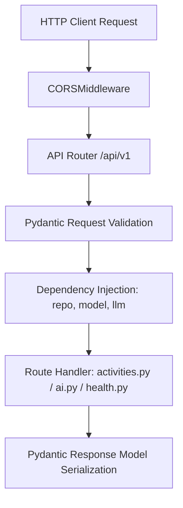

# Q-BIT.140 — M4 Backend API Integration Deep Dive

## 1. Gateway Architecture & Startup Lifecycle

- **Web Framework**: FastAPI 0.110+ on ASGI server Uvicorn.
- **Contract Enforcement**: Pydantic v2 schemas (`backend/api/schemas.py`).
- **Dependency Injection**: Modular dependency providers (`backend/api/dependencies.py`).
- **Static Mounting**: Serves `frontend/` directory as static assets at root path `/`.



---

## 2. Complete REST API Endpoints Specification

### 1. `GET /health`
- **Purpose**: Liveness and readiness probe.
- **Request**: None.
- **Response Model**: `HealthResponse` (`{"status": "ok", "service": "qbit-api", "version": "0.1.0"}`).
- **Status Code**: 200 OK.
- **Test**: `tests/api/test_health.py`.

### 2. `GET /api/v1/activities`
- **Purpose**: List all registered MVP activities.
- **Request**: None.
- **Response Model**: `list[ActivitySummary]`.
- **Response Payload Example**:
  ```json
  [
    {
      "activity_id": "act_grover_2q_predict",
      "concept_id": "quantum.algorithm.grover_2q",
      "title": "Grover's 2-Qubit Search Prediction",
      "description": "Predict the most likely measurement outcome of a 2-qubit Grover search circuit targeting state |10⟩.",
      "task_type": "quantum_prediction",
      "prerequisites": ["quantum.qubit", "quantum.superposition", "quantum.gates", "quantum.measurement"]
    }
  ]
  ```
- **Status Code**: 200 OK.
- **Test**: `tests/api/test_activities.py`.

### 3. `GET /api/v1/activity/{activity_id}`
- **Purpose**: Retrieve complete specification for a single activity.
- **Path Parameter**: `activity_id: str` (e.g. `"act_grover_2q_predict"`).
- **Response Model**: `ActivityDetailResponse`.
- **Status Codes**: 200 OK, 404 Not Found (if activity ID is unregistered).
- **Test**: `tests/api/test_activities.py`.

### 4. `POST /api/v1/activity/{activity_id}/submit`
- **Purpose**: Execute vertical slice for a learner attempt.
- **Path Parameter**: `activity_id: str`.
- **Request Model**: `SubmissionRequest` (`{"learner_id": "mvp_evaluator_001", "response": "01"}`).
- **Internal Call Chain**:
  1. `get_activity(activity_id)`
  2. `repo.get(req.learner_id)` (Raises 503 on persistence failure)
  3. If `task_type == "quantum_prediction"`: `run_experiment(QuantumExperiment(**activity.quantum_experiment))` (Raises 500 on simulation failure)
  4. `evaluate_quantum_prediction(...)` $\rightarrow$ `LearnerEvidence`
  5. `model.record_evidence(evidence, state)` $\rightarrow$ `AdaptiveRecommendation`
  6. `repo.save(state)` (Raises 503 on persistence failure)
  7. Return `SubmissionResponse`.
- **Status Codes**: 200 OK, 404 Not Found, 422 Validation Error, 500 Quantum Execution Error, 503 Storage Unavailable.
- **Test**: `tests/api/test_submissions.py`, `tests/api/test_pass6_hardening_validation.py`.

### 5. `POST /api/v1/ai/ask`
- **Purpose**: Handle general conceptual questions with RAG grounding.
- **Request Model**: `AskRequest` (`{"question": "What is a qubit?", "concept_id": "quantum.qubit"}`).
- **Response Model**: `AskResponse` (`{"question": "...", "answer": "...", "concept_id": "..."}`).
- **Status Codes**: 200 OK, 503 Service Unavailable (if LLM provider fails).
- **Test**: `tests/api/test_ai.py`.

### 6. `POST /api/v1/ai/explain_experiment`
- **Purpose**: Generate grounded AI explanation of a completed experiment attempt.
- **Request Model**: `ExplainExperimentRequest` (contains `learner_response`, `verified_result`, `evidence`, `adaptive_decision`, `user_question`).
- **Response Model**: `ExplainExperimentResponse` (`{"explanation": "...", "learner_response": "...", "adaptive_decision": {...}}`).
- **Status Codes**: 200 OK, 503 Service Unavailable.
- **Test**: `tests/api/test_ai.py`.
