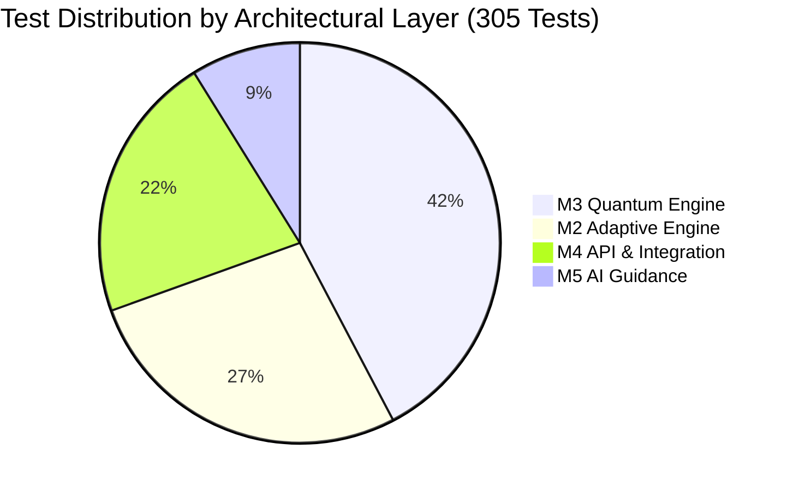

# Q-BIT.140 — Test Forensic Audit

## 1. Test Suite Summary & Execution Metrics

- **Total Test Files Discovered**: 37 test files (plus 4 `__init__.py` files)
- **Total Tests Executed**: **305 passed** (0 failed, 1 warning)
- **Execution Time**: **4.92 seconds**
- **Test Framework**: `pytest 9.1.1` with `pytest-asyncio` and FastAPI `TestClient`.
- **Coverage Distribution**:
  - **M3 Quantum Engine**: 129 tests (10 files) — $42.3\%$ of test suite
  - **M2 Adaptive Engine**: 83 tests (11 files) — $27.2\%$ of test suite
  - **M4 REST API & Integration**: 66 tests (12 files) — $21.6\%$ of test suite
  - **M5 Grounded AI Guidance**: 27 tests (4 files) — $8.9\%$ of test suite

---

## 2. Directory Breakdown & Test File Forensic Catalog

### A. Quantum Test Suites (`tests/quantum/` — 129 Tests)
1. `test_public_api.py` (41 tests): Comprehensive public API boundary tests, Qiskit-free serialization, parameter validation.
2. `test_circuit_metadata.py` (22 tests): Verifies `extract_circuit_metadata()`, depth calculation, gate counts, and text diagram rendering.
3. `test_execution.py` (17 tests): Tests `execute_circuit()` against `AerSimulator()`, verifying total shot sums and count distributions.
4. `test_grover.py` (14 tests): Validates circuit structure, Hadamard placement, oracle phase inversion, and diffusion for all 4 two-qubit targets (`"00"`, `"01"`, `"10"`, `"11"`).
5. `test_engine.py` (13 tests): End-to-end `run_experiment()` verification, contract validation, error catching.
6. `test_results.py` (13 tests): Tests `SimulationResult` post-init validation, `@property` getters (`probabilities`, `most_likely_state`), and `to_dict()`.
7. `test_validator.py` (4 tests): Tests `validate_experiment()` parameter verification.
8. `test_registry.py` (3 tests): Tests algorithm registry lookups and missing algorithm exceptions.
9. `test_package.py` (1 test): Verifies package export symbols in `backend/quantum/__init__.py`.
10. `test_schema.py` (1 test): Verifies `QuantumExperiment` dataclass defaults.

### B. Adaptive Test Suites (`tests/adaptive/` — 83 Tests)
1. `test_persistence_hardening.py` (13 tests): Tests repository persistence failure handling, atomic saves, corrupt state handling.
2. `test_evidence.py` (12 tests): Validates `evaluate_quantum_prediction()`, sufficiency tagging, and evidence dataclasses.
3. `test_models.py` (11 tests): Tests dataclass serialization, `LearnerState` mutation, and `LearnerContext` construction.
4. `test_pass4_evidence_trace.py` (9 tests): Verifies end-to-end evidence IDs, trigger labels, and cognitive hypothesis generation.
5. `test_diagnostics.py` (9 tests): Validates diagnostic question loader from CSV and quiz scoring logic.
6. `test_mastery.py` (7 tests): Validates Bayesian mastery formula, recency decay weight ($\lambda = 0.85$), and prerequisite gating rule.
7. `test_routing.py` (6 tests): Validates deterministic routing rules (`advance`, `gather_evidence`, `targeted_remediation`).
8. `test_state_semantics.py` (6 tests): Validates state determinism, idempotency, and audit trail accumulation.
9. `test_activities.py` (5 tests): Tests activity catalog lookups and prerequisite chains.
10. `test_evidence_progression.py` (4 tests): Verifies multi-attempt evidence accumulation and transition from `insufficient` to `sufficient`.
11. `test_vertical_slice.py` (1 test): End-to-end unit test of the M2 decision cycle.

### C. API & Integration Test Suites (`tests/api/` — 66 Tests)
1. `test_frontend_adapter_and_binding.py` (12 tests): Verifies JavaScript adapter contracts and DOM data bindings.
2. `test_adaptive_vertical_slice.py` (8 tests): End-to-end integration tests through FastAPI endpoints.
3. `test_pass6_hardening_validation.py` (8 tests): Hardening tests verifying error status codes (404, 422, 500, 503).
4. `test_json_contracts.py` (7 tests): Schema validation tests verifying JSON serialization structures.
5. `test_pass2_contracts_dataflow_graph.py` (6 tests): Data flow graph verification across all pipeline stages.
6. `test_m1_m6_integration.py` (5 tests): Integration tests between M1 UI and M6 visualization models.
7. `test_submissions.py` (4 tests): Integration tests for `POST /api/v1/activity/{id}/submit`.
8. `test_ai.py` (4 tests): Integration tests for AI routes `/ask` and `/explain_experiment`.
9. `test_pass5_why_this_next_ux.py` (4 tests): Verifies UX explanation contract for adaptive decisions.
10. `test_activities.py` (3 tests): Integration tests for activity retrieval endpoints.
11. `test_m6_adapter.py` (3 tests): Tests `normalizeSubmissionResponse()` data transformation.
12. `test_health.py` (2 tests): Tests `GET /health` endpoint.

### D. Grounded AI Test Suites (`tests/ai/` — 27 Tests)
1. `test_m5_grounded_guidance.py` (18 tests): Exhaustive boundary tests proving the LLM cannot fabricate counts or alter learner mastery.
2. `test_retrieval.py` (4 tests): Tests markdown knowledge base retrieval and concept ranking.
3. `test_providers.py` (3 tests): Unit tests for `GroqLLMProvider` and `MockLLMProvider`.
4. `test_service.py` (2 tests): Tests high-level orchestration in `ask_question()` and `explain_experiment()`.
